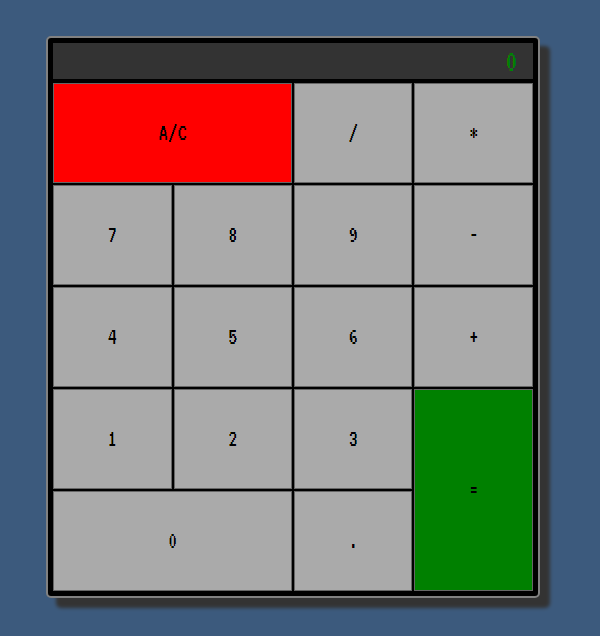

# A FreeCodeCamp React Project

A simple calculator built in React for a FreeCodeCamp React Project. MathJS handles executing a string expression that is built up by pressing buttons. The layout is built on CSS Grid and Styled Components.

